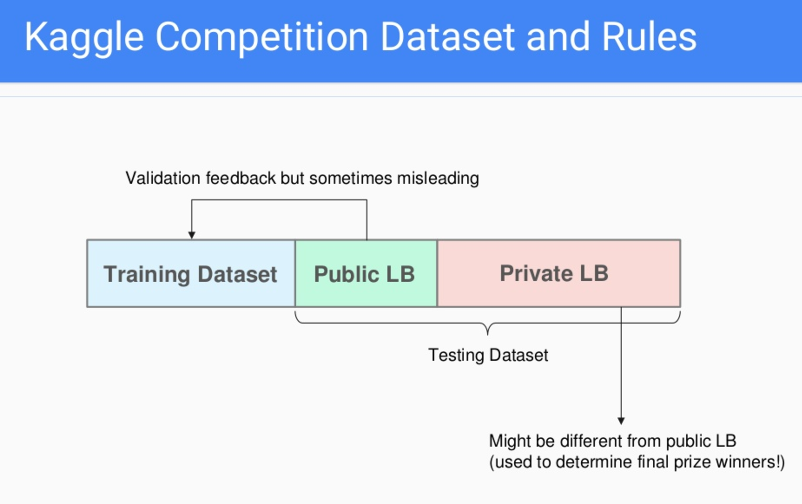
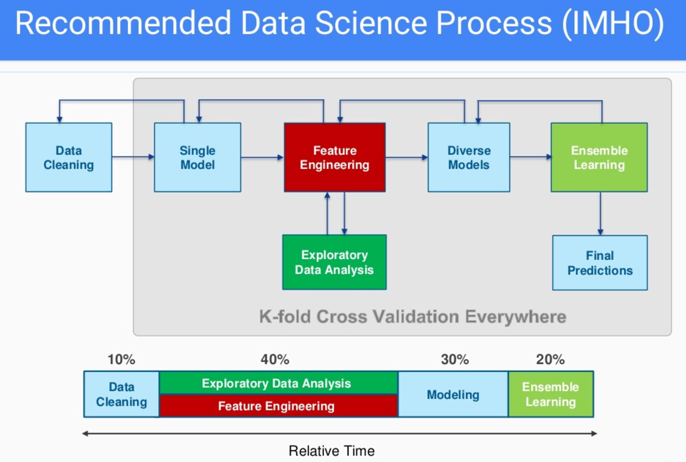
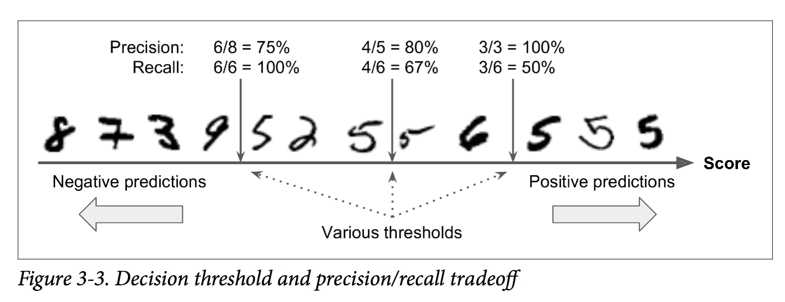
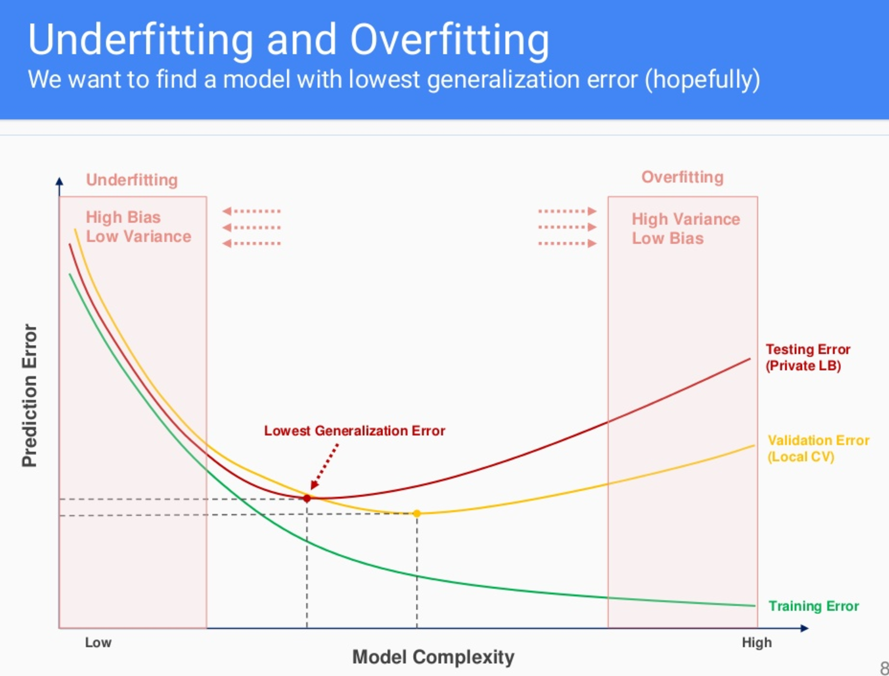
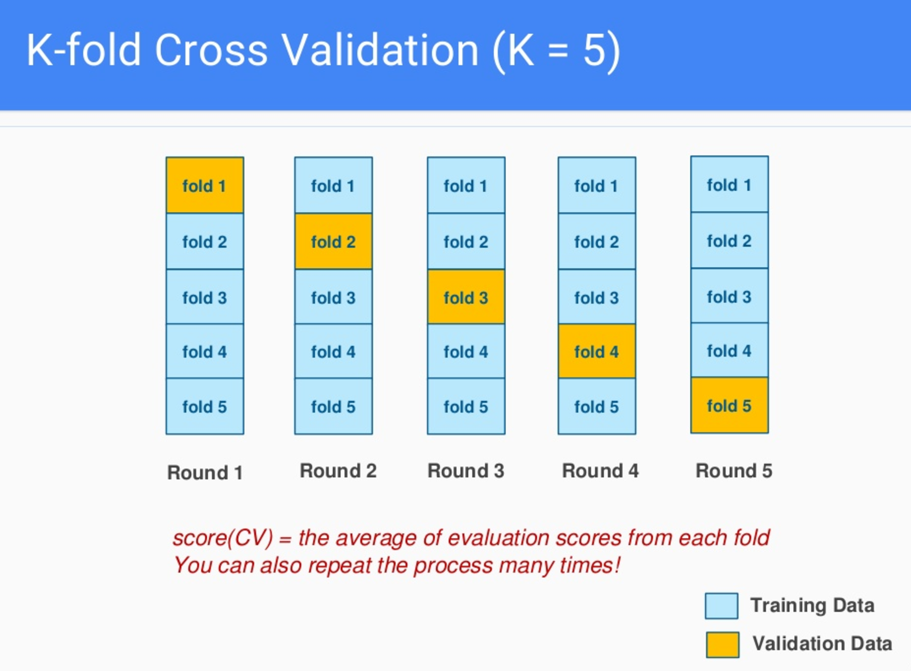

Walking Kaggle Part2 소개
========================================================
author: Sang Yeol Lee
date: August 25 2017
width: 1500 
height: 1800
transition: linear
transition-speed: slow
autosize: true

- 대상자 
  - 스터디는 취미 모임이기 때문에 참여는 누구나 가능, 다만 지속적으로 참여할 수 있는 분만 
  - 다만 R 또는 Python 중에서 최소 1개 언어를 다룰 줄 아셔야 되고 머신러닝 기초가 있어야 참여하는데 어렵지 않음.
  - 언어를 다루지 못하고 머신러닝을 잘 모르시면 다른 스터디를 권유드립니다. ([싸이버스 참조](https://www.facebook.com/thepsybus))
  - 토요일 격주로 진행 (오전 10시 ~ 오후 1시, 장소는 토즈 강남점)
  - 스터디 공지는 캐글뽀개기 페이스북, 싸이버스

<h2> - 주제 : 캐글 도전반 (정말.. 캐글을 뽀개봅시다)

- 운영 지원: [캐글뽀개기](https://www.facebook.com/groups/kagglebreak) 

- 장소 지원: [kosslab](https://kosslab.kr/)


- [페북 이벤트 링크](https://www.facebook.com/events/1945163935730064)
- 스터디 자료는 구글드라이브 또는 github을 통해서 관리할 예정입니다.

  - [github  주소](https://github.com/KaggleBreak/walkingkaggle)

  - [스터디 구글드라이브](https://drive.google.com/drive/folders/0B2l0iH28o85xSG83OTVfMzhhNFE?usp=sharing) 

  - [스터디 일정표](https://docs.google.com/spreadsheets/d/15OgrZKj6pD0jptFnkTIWioqC1_2_eoJidkysRXBlDyw/edit#gid=0)

========================================================
id: slide1
type: prompt

# Kaggle - https://www.kaggle.com

- Wikipedia - Kaggle?
  - Kaggle은 기업 및 연구원이 데이터 및 통계를 게시하고 데이터 마이너가 예측 및 설명을 위한 최상의 모델을 만들기 위해 경쟁하는 예측 모델링 및 분석 경쟁을위한 플랫폼. Crowdsourcing 접근 방식은 예측 모델링 작업에 적용 할 수있는 무수한 전략이 있으며 어떤 기술 또는 분석가가 가장 효과적인지를 처음부터 알 수 없다는 사실에 의존.

<br>

## 오늘 일정?
  - 스터디 소개 (10시~ 10시20분)
  - 일반적인 캐글 단계 (10시 20분 ~ 10시 40분)
  - house price 문제 설명 (10시 40분 ~ 10시 50분)
  - 쉬는 시간 (10시 50분 ~ 11시)
  - 조 구성 하기 (11시 ~ 11시 50분)
  - 쉬는 시간 (11시 50분 ~ 12시)
  - 캐글 문제 같이 풀어보기 (12시 ~ 12시 50분)
  - 종료

<br>

## 자료참고 레퍼런스
  [General Tips for participating Kaggle Competitions, Mark Peng, Taiwan Kaggle Master](https://www.slideshare.net/markpeng/general-tips-for-participating-kaggle-competitions) 


***
<br>


========================================================
## 2단계 : 일반적인 캐글 접근방법(1)

[Go to slide 1](#/slide1)



- 일반적인 캐글의 데이터 셋은 Train set, Test Set으로 나뉨 (Submission 파일이 따로 있음)

- Test Set은 대회 기간 동안 제출하면 채점 용도로 공개되어 있는 Public LB(Leardboard)와 대회 끝난 후 최종 채점을 평가하는 Private LB(Leardboard)가 있음


- 물론 데이터 셋이 일반적이지 않을 수 있음
    - DB 관계도를 주고 직접 구성하라고 하는 경우 (DB 소스를 직접 주거나)
    - 데이터가 커서 접근할 수 있는 클라우드 주소를 주고 해당 클라우드에서 진행하라고 하거나
    - (옵션) 특정 데이터의 사용 유무는 참가자가 정하거나
    - 데이터의 종류는 이미지, 영상, 텍스트, 숫자. 정형 데이터 또는 비정형 데이터 모두 다룰 수 있음.


- 대회의 목적(상금, 직업, 지식 공유...)에 따라서 문제가 달라짐.


========================================================
## 2단계 : 일반적인 캐글 접근방법(2)



- 캐글 프로세스는 데이터 분석의 절차 (서비스의 직접 반영하진 않지만, 커뮤니케이션은 포럼의 참가자들과 Kernel에서 Notebook 형태로 공유)

- 1단계 데이터 전처리, 2단계 싱글 모델, 3단계 변수 구성, 4단계 탐색적 자료 분석, 5단계 다양한 모델 구성, 6단계 앙상블, 7단계 예측


- 데이터 전처리 
    - 데이터를 (로컬 혹은 서버)에서 읽을 수 있는 사이즈인지? (메모리, 하드) 
    - 데이터의 마이그레이션은 어떻게 할 수 있는지?
    - 변수로 구성할 수 있는 데이터와 구성할 수 없는 데이터가 무엇에 있는지?


- 싱글 모델
    - 기본으로 대회에서 제공한 변수 기준으로 1차 모델을 구성


- 변수 구성
    - Submission ID의 추가할 수 있는 변수가 어떤 것이 있을까?
    - 변수 선택, 차원 축소, 중요한 변수 확인 (모델 기반)
    - Single 모델 별로 유용한 변수를 추리는 것. 모델에 걸리는 시간 고려
    - 텍스트 또는 카테고리 변수는 어떻게 활용할 것인지?
    
    
- 탐색적 자료 분석
    - 변수들의 데이터의 분포는 어떻게 되는지? (단변량)
    - 변수들간의 관계는 어떻게 되는지? (다변량)
    - 이상치는 어떻게 확인하고 어떤 조치를 취할 수 있는지? 
    - 데이터 정규화
    - 어떤 변수를 더 추가할 수 있는지 아이디어 또는 인사이트 발견
    

========================================================
## 2단계 : 일반적인 캐글 접근방법(3)

- 다양한 모델 구성
    - 문제가 회귀, 분류, 추천 어떤 것을 목적으로 삼고 있는지에 따라 모델 구성이 다름
    - (분류) 로지스틱 회귀모형, Tree 모델, Bayesian 모델, 신경망 모델, Kernel 모델 등 구성 하여 모델 간의 결과 값 기반하여 상관관계 파악
    - 모델들의 다양한 파라미터를 어떻게 구성할 것인지?
        - 파라미터 별로 성능 파악 (조합), 또는 일반적으로 구성하는 파라미터를 디폴트로 구성
    - 목표 변수 이전의 모델의 네트워크를 구성할 것인지? (변수 구성 과정에서 다양한 모델로 x 변수를 다수 만들어냄)


- 앙상블
    - 블랜딩 작업 (모델에서 나오는 결과 값들의 평균을 가지고 예측할 것인지? 아니면 가중치?)
    - 모델 결과들의 값들을 합쳐서 다시금 부스팅으로 학습
    - Public의 제출하면서 다시금 파라미터 또는 모델을 조정하면서 학습
   

- 제출
    - Submission.csv 파일로 예측 결과를 데이터로 제출.
    - 문제에 따라 제출 형태도 다르고 평가 방식도 다름.
    - 클래스의 확률로 제출하거나, 클래스의 값을 제출하거나, 여러 개의 값 (상위 5개)를 제출하거나
    - 평가 방식 F1 Score, Logloss... [https://en.wikipedia.org/wiki/Precision_and_recall]
    
    - F1 Score : F1 score is the harmonic mean of precision and sensitivity
    
    - precision : 맞다고 예측 한 것 중에 실제로 정답이 얼마나 되나?  $${\displaystyle \mathrm {PPV} ={\frac {\mathrm {TP} }{\mathrm {TP} +\mathrm {FP} }}}$$
    - sensitivity : or Recall, 맞는 케이스에 대해 얼마나 많이 맞다고 실제로 예측했나?, $${\displaystyle \mathrm {TPR} ={\frac {\mathrm {TP} }{P}}={\frac {\mathrm {TP} }{\mathrm {TP} +\mathrm {FN} }}}$$
    
    - Logloss는 뒤에서 설명
 
========================================================
## 2단계 : 일반적인 캐글 접근방법(4)

- precision, Recall(sensitivity) Example (Hands on ML with Sciki-learn with Tensorflow 책 발췌)

    - 숫자 인식 문제에서 “5-detector”로 binary class 문제를 맞춘다고 한다면
    - 제일 왼쪽 부분에서 threshold를 결정하게 되면(오른쪽은 5, 왼쪽은 5가 아님) True 5를 잘 맞추게 됨. 그래서 True 5 모두 다 5라고 예측함. 다만 Precision 측면에서 5라고 주장한 것중에서(전체 8개)에서 2개가 틀리게 되어 75%(2, 6)
    - 중앙 부분에서 threshold를 결정하게 되면 Recall은 67% (True 5 중에서 2개를 놓치게 됨), Precision 측면에서는 5라고 주장한 것중에서 1개만 틀려서 80%.
    - 제일 오른쪽 부분에서 threshold를 결정하게 되면 Recall은 50% (True 5중에서 3개를 놓치게 됨), Precision 측면에서 5라고 주장한 것중에서 하나도 틀리지 않아 100%
    - 문제에 따라 Precision, Recall 중에서 중요한 지표가 달라짐. 두 지표를 모두 고려하는 것이 F1 score.
    


========================================================
## 2단계 : 일반적인 캐글 접근방법(5)



- 모델을 구성할 때 Bias-Variance Trade off 관계에 있음

- [Bias-Variance Tradeoff Wikipedia](https://en.wikipedia.org/wiki/Bias%E2%80%93variance_tradeoff)

### - Bias? 
- Bias는 학습 알고리즘에서 잘못된 가정으로 부터 나오는 에러
- High Bias - Low Variance / Underfitting 
- 몸무게 = Beta 0 + 키 * Beta1 일거야.

### - Variance?
- Variance는 훈련 데이터 내의 작은 변동에 대한 민감성으로부터 나오는 에러이다. 높은 variance는 의도한(일반화) 학습결과를 내기보다는 훈련 데이터 내의 무작위 소음을 모델링함에 따라 과적합을 야기한다
- Low Bias - High Variance / Overfitting 
- 몸무게 = Beta 0 + 키 * Beta1 + 키^2 * Beta2 + 키^3 * Beta3... + 키^8 + Beta8  일거야.

- 어떤 모델이든 Underfitting 하거나 Overfitting 할 수 있음, 적정선을 찾아야 함.
- 주로 Train 데이터를 Validaton 하여 해당 에러와 Test 에러를 같이 확인
- Test Error를 보기 전에 평가 함수를 구성하여 Validation Error를 확인하는 것이 핵심! (Cross Validation, Local CV)
    

========================================================
## 2단계 : 일반적인 캐글 접근방법(6)



- K-Fold Cross Validation (K=5)

- 균일하게 K 갯수만큼 Train 데이터를 쪼갬. k=5이면 5개로 쪼개서, Round 1~5번까지 Train data의 80%를 모델 구성하는데 사용하고 20%를 Validation 하는 데 사용, 해당 작업을 5번 거쳐서 평균 cv를 구하여 모델을 평가

- local CV와 Public LB 간의 갭 차이가 나는 K를 찾는 것이 팁. 데이터가 Imbalance 되어 있다면 Stratified K-fold cv(목표변수의 클래스 비율을 똑같이 구성하여 쪼개는 방법)를 구성하라고 추천하고 있음

- [Stratified K-fold cv, scikit-learn](http://scikit-learn.org/stable/modules/generated/sklearn.model_selection.StratifiedKFold.html)

========================================================
## 3단계 : house price 문제 설명 (1)


- Ask a home buyer to describe their dream house

- With 79 explanatory variables describing (almost) every aspect of residential homes in Ames, Iowa, this competition challenges you to predict the final price of each home.

### File descriptions

- train.csv - the training set
- test.csv - the test set
- data_description.txt - full description of each column, originally prepared by Dean De Cock but lightly edited to match the column names used here
- sample_submission.csv - a benchmark submission from a linear regression on year and month of sale, lot square footage, and number of bedrooms

========================================================
## 3단계 : house price 문제 설명 (2)

### Data fields

Here's a brief version of what you'll find in the data description file.

- SalePrice : 재산의 판매 가격은 달러입니다. 이것은 예측하려는 대상 변수입니다.
- MSSubClass: 건물 클래스
- MSZoning: 일반 구역 분류
- LotFrontage: 재산에 연결된 거리의 선형 다리
- LotArea: 로트 크기 (스퀘어 피트)
- Street: 도로 접근의 유형
- Alley: 골목길의 유형
- LotShape: 부동산의 일반적인 모양
- LandContour: 부동산의 평평함
- Utilities: 사용 가능한 유틸리티 유형
- LotConfig: 로트 구성
- LandSlope: 부동산의 기울기
- Neighborhood: Ames시의 한도 내 물리적 위치
- Condition1: 주요 도로 또는 철도까지의 거리
- Condition2: 주요 도로 또는 철도 근접 거리 (초가있는 경우)
- BldgType: 거주 유형
- HouseStyle : 주거 스타일
- OverallQual : 전체 재질 및 마감 품질
- OverallCond : 전체 조건 등급
- YearBuilt : 원래 건설 날짜
- YearRemodAdd : 개장 날짜
- RoofStyle : 지붕 유형
- RoofMatl : 지붕 재료
- Exterior1st : 집안의 외장
- Exterior2nd : 주택의 외장 (둘 이상의 재료 인 경우)
- 마스 VnrType : 석조 베니어 유형
- MasVnrArea : 벽돌 베니어 면적 (평방 피트)
- ExterQual : 외관 재질
- ExterCond : 외부 물질의 현재 상태
- Foundation: 기초 유형
- BsmtQual : 지하실의 높이
- BsmtCond : 지하실의 일반적인 상태
- BsmtExposure : 도보 또는 정원 수준 지하 벽
- BsmtFinType1 : 지하실 마감 지역의 품질
- BsmtFinSF1 : 유형 1 평방 피트 완료
- BsmtFinType2 : 두 번째 완성 된 영역의 품질 (있는 경우)
- BsmtFinSF2 : 유형 2 평방 피트 완료
- BsmtUnfSF : 지하 공간의 미완성 된 평방 피트
- TotalBsmtSF : 지하실 면적의 총 평방 피트
- Heating: 난방의 종류
- HeatingQC: 난방 품질 및 상태
- CentralAir : 중앙 에어 컨디셔닝
- Electrical: 전기 시스템
- 1stFlrSF : 1 층 평방 피트
- 2ndFlrSF : 2 층 평방 피트
- LowQualFinSF : 낮은 품질로 완성 된 평방 피트 (모든 층)
- GrLivArea : 위의 (지상) 생활 면적 스퀘어 피트
- BsmtFullBath : 지하실 가득한 욕실
- BsmtHalfBath : 지하 욕실 반 화장실
- FullBath : 고급 욕실
- HalfBath :반 욕조
- Bedroom: 지하실 위 침실 수
- Kitchen: 부엌 수
- KitchenQual: 주방 품질
- TotRmsAbvGrd: 학년 이상 총 객실 (욕실 제외)
- Functional: 집 기능 평가
- Fireplaces: 벽난로 수
- FireplaceQu : 벽난로 품질
- GarageType : 차고 위치
- GarageYrBlt : 1 년 차고가 건조되었습니다.
- GarageFinish : 차고 내부 마무리
- GarageCars : 자동차 용량의 차고 크기
- GarageArea : 평방 피트 단위의 차고 크기
- GarageQual : 차고 품질
- GarageCond : 차고 조건
- PavedDrive : 포장 도로
- WoodDeckSF : 평방 피트 단위의 우드 데크 구역
- OpenPorchSF : 오픈 베란다 면적 (평방 피트)
- EnclosedPorch: 동봉 된 현관 면적
- 3SsnPorch : 세 자리 현관 면적 (평방 피트)
- ScreenPorch : 스크린 현관 면적 (평방 피트)
- PoolArea : 풀 면적 (스퀘어 피트)
- PoolQC : 풀 품질
- Fence: 울타리 품질
- MiscFeature : 기타 카테고리에서 다루지 않는 기타 기능
- MiscVal : 기타 기능의 가치
- MoSold : 매월 팔렸습니다.
- YrSold : 판매 된 연도
- SaleType: 판매 유형
- SaleCondition: 판매 조건

========================================================
## 3단계 : house price 문제 설명 (3)

### Goal
- 각 주택의 판매 가격을 예측하는 것. 테스트 세트의 각 ID에 대해 SalePrice 변수의 값을 예측

### Metric
- 제출물은 예측 값의 로그와 관측 된 판매 가격의 대수 사이의 RMSE (Root-Mean-Squared-Error)로 평가됩니다. 

### [RMSE](https://en.wikipedia.org/wiki/Root-mean-square_deviation)


### Submission File Format
- samplesubmision.csv 파일 형태

```
Id,SalePrice
1461,169000.1
1462,187724.1233
1463,175221
etc.
```

### Tutorial
- https://www.kaggle.com/c/house-prices-advanced-regression-techniques#tutorials 참고

========================================================
## 4단계 : 조 구성하기 (1)

### 사용하는 주 언어는 무엇입니까?
- R 사용자 (약 31.7%)
- Python 사용자 (약 58.3%)


### 캐글 대회에 참여한 횟수?
- 0회 (약 65%)
- 1회 (약 20%)
- 2회 (약 6.7%)
- 3~4회 (약 5%)
- 5회 이상 (약 3.3%)


### 하는 일은 무엇입니까?
- 직장인 (약 50%)
- 대학생 (약 28.3%)
- 대학원생 (약 6.7%)
- 취업준비생 (약 15%)


========================================================
## 4단계 : 조 구성하기 (2)

### [스터디 참가자 행동강령, 꼭 지켜주세요](https://www.facebook.com/groups/kagglebreak/permalink/1967162913538381/)

<br>

### 발표 원칙
- 조 별로 최소 1개 대회를 진행하고 캐글뽀개기 스터디 내에서 공유하는 것 (중간 / 최종 발표 1번 식)
  - 중간 발표의 원칙
    (조 별로 자유롭게 내용 선정하여 발표, Ex. 데이터 전처리, 탐색적 데이터 분석, 싱글 모델까지만 진행)
  - 최종 발표의 원칙
    (조 별로 발표 날까지의 제출 기준으로 내용을 참가자들에게 공유)
  - 발표 시간은 중간, 최종 약 20~40 분 정도
  
### 주제 
- 이번 스터디에는 총 3개 대회 진행 예정(일반 대회 2개, 튜토리얼 대회 1~2개)
- 튜토리얼 대회 제외한 일반 2개 대회에서 Public LB 또는 Private LB가 가장 높은 팀 2팀 선정
  - 가장 높은 2팀 전원에게는 상금(데이터 분석 관련 책 전달) 예정, (참가자들에게 필요한 비용은 추후 공지드리겠습니다)
- 튜토리얼 대회는 오늘 공유드린 [부동산 가격 문제](https://www.kaggle.com/c/house-prices-advanced-regression-techniques) 또는 [타이타닉 문제](https://www.kaggle.com/c/titanic#tutorials) 대회 중에서 진행하며 처음 캐글에 참여하는 분들은 해당 대회로 시작하길 권장함

### 조별 진행방법
- 조는 참여 주제 / 사용 언어에 따라서 구성하려고 함, 같은 조 내에서는 되도록 1개 언어를 사용할 것을 권장함
  - 조별로 참여하기 부담스러운 분은 개인으로 참여해도 됨, 다만 다른 조처럼 공유/발표를 똑같이 해야함
- 조별, 개인으로 참여하기 어려운 분은 스터디 참여를 되도록 권장하진 않음
- 조별로 스케줄은 알아서 정함(오프라인, 온라인), 스케줄은 진행하는 조장이 정하는 것으로 함.
- 조별로 역할 분담은 알아서 정함. 역할 분담도 진행하는 조장이 정하는 것으로 함.
- 토요일 격주로 만날 때는 발표 내용만 공유하는 것으로 함

========================================================
## 4단계 : 조 구성하기 (3)

### Q&A?
- 개별로 모여서 진행할 때에는 장소 지원이 되나요?
  - 불가능합니다..ㅜㅜ 다만 모이시면 사진 공유도 페이스북 통해서 해주시면 감사드립니다.
- 참여할 수 있는 시간이 애매한데 어떻게 해야될까요?
  - 직장인 분들도 많기 때문에 시간이 서로 잘 안나서 진행이 원활하게 안되는 것이 사실입니다. 한 분이 혼자서 하게 될 가능성이 높은데 같이 서로 알려주면서 할 수 있으면 좋겠고 그래서 캐글을 처음 접하는 분들은 튜토리얼을 먼저 진행하는 것을 권장합니다. 대회 진행 하실 때 여유있게 하는 것을 목표로 합니다. 조별로 최소 한 ~ 두달 정도 시간을 드릴 예정입니다.
- 자료는 어떻게 공유하면 되나요?
  - github 또는 구글드라이브로 주제 별 폴더를 만들테니 해당 폴더에 자료를 올려주세요. github 권한 드리겠습니다.
- 커뮤니케이션은 어떻게 하면 될까요?
  - 조별로 자유롭게 하시면 됩니다.
- 잘 모르는데 참여해도 될까요?
  - 캐글을 잘 모르면 우선 튜토리얼부터 하시죠! 그리고 모든 대회 마찬가지만 목표는 커널에 있는 코드들을 이해하여 리뷰하고 공유하는 것도 좋은 발표 자료일 수 있습니다. 
-  스터디 참여하다가 불가피하게 시간이 안되면 어떻게 할까요?
  - 조장님에게 연락주시고, 조장님이 힘들면 발표 스케줄은 조정 가능하니깐 저에게 연락주세요~

========================================================
## 4단계 : 조 구성하기 (4)

### 일반 대회

- 후보 주제(1)
: [Web Traffic Time Series Forecasting](https://www.kaggle.com/c/web-traffic-time-series-forecasting)
  - forecasting the future values of multiple time series
  - on the problem of forecasting future web traffic for approximately 145,000 Wikipedia articles.
  - 16일 남았음, Symmetric mean absolute percentage error, [Evalution](https://www.kaggle.com/c/web-traffic-time-series-forecasting#evaluation)
  
- 후보 주제(2)
: [New York City Taxi Trip Duration](https://www.kaggle.com/c/nyc-taxi-trip-duration)
  - predicts the total ride duration of taxi trips in New York City
  - Your primary dataset is one released by the NYC Taxi and Limousine Commission, which includes pickup time, geo-coordinates, number of passengers, and several other variables.
  - 21일 남았음, RMSLE [Evaluation](https://www.kaggle.com/c/nyc-taxi-trip-duration#evaluation)


- 후보 주제(3)
: [Zillow Prize: Zillow’s Home Value Prediction](https://www.kaggle.com/c/zillow-prize-1)
  - “Zestimates” are estimated home values based on 7.5 million statistical and machine learning models that analyze hundreds of data points on each property.
  - 5달 남았음, Mean Absolute Error [Evaluation](https://www.kaggle.com/c/zillow-prize-1#evaluation)


### 튜토리얼

- 튜토리얼 주제(1)
: [부동산 가격 문제](https://www.kaggle.com/c/house-prices-advanced-regression-techniques) 

- 튜토리얼 문제(2)
: [타이타닉 문제](https://www.kaggle.com/c/titanic#tutorials)

========================================================
## 4단계 : 조 구성하기 (5)

### - 조 구성하기

### - 조별 스케줄 짜기

### - 쉬는 시간

========================================================
## 5단계 : 캐글문제 같이 풀어보기(1)

- 여기서부터 수정중


```r
library(tidyverse)

#ref1 : https://www.kaggle.com/notaapple/detailed-exploratory-data-analysis-using-r
#ref2 : https://www.kaggle.com/jiashenliu/house-prices-advanced-regression-techniques/updated-xgboost-with-parameter-tuning/run/362252

train <- read_csv('./data/train.csv')
colnames(train)
```

```
 [1] "Id"            "MSSubClass"    "MSZoning"      "LotFrontage"  
 [5] "LotArea"       "Street"        "Alley"         "LotShape"     
 [9] "LandContour"   "Utilities"     "LotConfig"     "LandSlope"    
[13] "Neighborhood"  "Condition1"    "Condition2"    "BldgType"     
[17] "HouseStyle"    "OverallQual"   "OverallCond"   "YearBuilt"    
[21] "YearRemodAdd"  "RoofStyle"     "RoofMatl"      "Exterior1st"  
[25] "Exterior2nd"   "MasVnrType"    "MasVnrArea"    "ExterQual"    
[29] "ExterCond"     "Foundation"    "BsmtQual"      "BsmtCond"     
[33] "BsmtExposure"  "BsmtFinType1"  "BsmtFinSF1"    "BsmtFinType2" 
[37] "BsmtFinSF2"    "BsmtUnfSF"     "TotalBsmtSF"   "Heating"      
[41] "HeatingQC"     "CentralAir"    "Electrical"    "1stFlrSF"     
[45] "2ndFlrSF"      "LowQualFinSF"  "GrLivArea"     "BsmtFullBath" 
[49] "BsmtHalfBath"  "FullBath"      "HalfBath"      "BedroomAbvGr" 
[53] "KitchenAbvGr"  "KitchenQual"   "TotRmsAbvGrd"  "Functional"   
[57] "Fireplaces"    "FireplaceQu"   "GarageType"    "GarageYrBlt"  
[61] "GarageFinish"  "GarageCars"    "GarageArea"    "GarageQual"   
[65] "GarageCond"    "PavedDrive"    "WoodDeckSF"    "OpenPorchSF"  
[69] "EnclosedPorch" "3SsnPorch"     "ScreenPorch"   "PoolArea"     
[73] "PoolQC"        "Fence"         "MiscFeature"   "MiscVal"      
[77] "MoSold"        "YrSold"        "SaleType"      "SaleCondition"
[81] "SalePrice"    
```

```r
glimpse(train)
```

```
Observations: 1,460
Variables: 81
$ Id            <int> 1, 2, 3, 4, 5, 6, 7, 8, 9, 10, 11, 12, 13, 14, 1...
$ MSSubClass    <int> 60, 20, 60, 70, 60, 50, 20, 60, 50, 190, 20, 60,...
$ MSZoning      <chr> "RL", "RL", "RL", "RL", "RL", "RL", "RL", "RL", ...
$ LotFrontage   <int> 65, 80, 68, 60, 84, 85, 75, NA, 51, 50, 70, 85, ...
$ LotArea       <int> 8450, 9600, 11250, 9550, 14260, 14115, 10084, 10...
$ Street        <chr> "Pave", "Pave", "Pave", "Pave", "Pave", "Pave", ...
$ Alley         <chr> NA, NA, NA, NA, NA, NA, NA, NA, NA, NA, NA, NA, ...
$ LotShape      <chr> "Reg", "Reg", "IR1", "IR1", "IR1", "IR1", "Reg",...
$ LandContour   <chr> "Lvl", "Lvl", "Lvl", "Lvl", "Lvl", "Lvl", "Lvl",...
$ Utilities     <chr> "AllPub", "AllPub", "AllPub", "AllPub", "AllPub"...
$ LotConfig     <chr> "Inside", "FR2", "Inside", "Corner", "FR2", "Ins...
$ LandSlope     <chr> "Gtl", "Gtl", "Gtl", "Gtl", "Gtl", "Gtl", "Gtl",...
$ Neighborhood  <chr> "CollgCr", "Veenker", "CollgCr", "Crawfor", "NoR...
$ Condition1    <chr> "Norm", "Feedr", "Norm", "Norm", "Norm", "Norm",...
$ Condition2    <chr> "Norm", "Norm", "Norm", "Norm", "Norm", "Norm", ...
$ BldgType      <chr> "1Fam", "1Fam", "1Fam", "1Fam", "1Fam", "1Fam", ...
$ HouseStyle    <chr> "2Story", "1Story", "2Story", "2Story", "2Story"...
$ OverallQual   <int> 7, 6, 7, 7, 8, 5, 8, 7, 7, 5, 5, 9, 5, 7, 6, 7, ...
$ OverallCond   <int> 5, 8, 5, 5, 5, 5, 5, 6, 5, 6, 5, 5, 6, 5, 5, 8, ...
$ YearBuilt     <int> 2003, 1976, 2001, 1915, 2000, 1993, 2004, 1973, ...
$ YearRemodAdd  <int> 2003, 1976, 2002, 1970, 2000, 1995, 2005, 1973, ...
$ RoofStyle     <chr> "Gable", "Gable", "Gable", "Gable", "Gable", "Ga...
$ RoofMatl      <chr> "CompShg", "CompShg", "CompShg", "CompShg", "Com...
$ Exterior1st   <chr> "VinylSd", "MetalSd", "VinylSd", "Wd Sdng", "Vin...
$ Exterior2nd   <chr> "VinylSd", "MetalSd", "VinylSd", "Wd Shng", "Vin...
$ MasVnrType    <chr> "BrkFace", "None", "BrkFace", "None", "BrkFace",...
$ MasVnrArea    <int> 196, 0, 162, 0, 350, 0, 186, 240, 0, 0, 0, 286, ...
$ ExterQual     <chr> "Gd", "TA", "Gd", "TA", "Gd", "TA", "Gd", "TA", ...
$ ExterCond     <chr> "TA", "TA", "TA", "TA", "TA", "TA", "TA", "TA", ...
$ Foundation    <chr> "PConc", "CBlock", "PConc", "BrkTil", "PConc", "...
$ BsmtQual      <chr> "Gd", "Gd", "Gd", "TA", "Gd", "Gd", "Ex", "Gd", ...
$ BsmtCond      <chr> "TA", "TA", "TA", "Gd", "TA", "TA", "TA", "TA", ...
$ BsmtExposure  <chr> "No", "Gd", "Mn", "No", "Av", "No", "Av", "Mn", ...
$ BsmtFinType1  <chr> "GLQ", "ALQ", "GLQ", "ALQ", "GLQ", "GLQ", "GLQ",...
$ BsmtFinSF1    <int> 706, 978, 486, 216, 655, 732, 1369, 859, 0, 851,...
$ BsmtFinType2  <chr> "Unf", "Unf", "Unf", "Unf", "Unf", "Unf", "Unf",...
$ BsmtFinSF2    <int> 0, 0, 0, 0, 0, 0, 0, 32, 0, 0, 0, 0, 0, 0, 0, 0,...
$ BsmtUnfSF     <int> 150, 284, 434, 540, 490, 64, 317, 216, 952, 140,...
$ TotalBsmtSF   <int> 856, 1262, 920, 756, 1145, 796, 1686, 1107, 952,...
$ Heating       <chr> "GasA", "GasA", "GasA", "GasA", "GasA", "GasA", ...
$ HeatingQC     <chr> "Ex", "Ex", "Ex", "Gd", "Ex", "Ex", "Ex", "Ex", ...
$ CentralAir    <chr> "Y", "Y", "Y", "Y", "Y", "Y", "Y", "Y", "Y", "Y"...
$ Electrical    <chr> "SBrkr", "SBrkr", "SBrkr", "SBrkr", "SBrkr", "SB...
$ 1stFlrSF      <int> 856, 1262, 920, 961, 1145, 796, 1694, 1107, 1022...
$ 2ndFlrSF      <int> 854, 0, 866, 756, 1053, 566, 0, 983, 752, 0, 0, ...
$ LowQualFinSF  <int> 0, 0, 0, 0, 0, 0, 0, 0, 0, 0, 0, 0, 0, 0, 0, 0, ...
$ GrLivArea     <int> 1710, 1262, 1786, 1717, 2198, 1362, 1694, 2090, ...
$ BsmtFullBath  <int> 1, 0, 1, 1, 1, 1, 1, 1, 0, 1, 1, 1, 1, 0, 1, 0, ...
$ BsmtHalfBath  <int> 0, 1, 0, 0, 0, 0, 0, 0, 0, 0, 0, 0, 0, 0, 0, 0, ...
$ FullBath      <int> 2, 2, 2, 1, 2, 1, 2, 2, 2, 1, 1, 3, 1, 2, 1, 1, ...
$ HalfBath      <int> 1, 0, 1, 0, 1, 1, 0, 1, 0, 0, 0, 0, 0, 0, 1, 0, ...
$ BedroomAbvGr  <int> 3, 3, 3, 3, 4, 1, 3, 3, 2, 2, 3, 4, 2, 3, 2, 2, ...
$ KitchenAbvGr  <int> 1, 1, 1, 1, 1, 1, 1, 1, 2, 2, 1, 1, 1, 1, 1, 1, ...
$ KitchenQual   <chr> "Gd", "TA", "Gd", "Gd", "Gd", "TA", "Gd", "TA", ...
$ TotRmsAbvGrd  <int> 8, 6, 6, 7, 9, 5, 7, 7, 8, 5, 5, 11, 4, 7, 5, 5,...
$ Functional    <chr> "Typ", "Typ", "Typ", "Typ", "Typ", "Typ", "Typ",...
$ Fireplaces    <int> 0, 1, 1, 1, 1, 0, 1, 2, 2, 2, 0, 2, 0, 1, 1, 0, ...
$ FireplaceQu   <chr> NA, "TA", "TA", "Gd", "TA", NA, "Gd", "TA", "TA"...
$ GarageType    <chr> "Attchd", "Attchd", "Attchd", "Detchd", "Attchd"...
$ GarageYrBlt   <int> 2003, 1976, 2001, 1998, 2000, 1993, 2004, 1973, ...
$ GarageFinish  <chr> "RFn", "RFn", "RFn", "Unf", "RFn", "Unf", "RFn",...
$ GarageCars    <int> 2, 2, 2, 3, 3, 2, 2, 2, 2, 1, 1, 3, 1, 3, 1, 2, ...
$ GarageArea    <int> 548, 460, 608, 642, 836, 480, 636, 484, 468, 205...
$ GarageQual    <chr> "TA", "TA", "TA", "TA", "TA", "TA", "TA", "TA", ...
$ GarageCond    <chr> "TA", "TA", "TA", "TA", "TA", "TA", "TA", "TA", ...
$ PavedDrive    <chr> "Y", "Y", "Y", "Y", "Y", "Y", "Y", "Y", "Y", "Y"...
$ WoodDeckSF    <int> 0, 298, 0, 0, 192, 40, 255, 235, 90, 0, 0, 147, ...
$ OpenPorchSF   <int> 61, 0, 42, 35, 84, 30, 57, 204, 0, 4, 0, 21, 0, ...
$ EnclosedPorch <int> 0, 0, 0, 272, 0, 0, 0, 228, 205, 0, 0, 0, 0, 0, ...
$ 3SsnPorch     <int> 0, 0, 0, 0, 0, 320, 0, 0, 0, 0, 0, 0, 0, 0, 0, 0...
$ ScreenPorch   <int> 0, 0, 0, 0, 0, 0, 0, 0, 0, 0, 0, 0, 176, 0, 0, 0...
$ PoolArea      <int> 0, 0, 0, 0, 0, 0, 0, 0, 0, 0, 0, 0, 0, 0, 0, 0, ...
$ PoolQC        <chr> NA, NA, NA, NA, NA, NA, NA, NA, NA, NA, NA, NA, ...
$ Fence         <chr> NA, NA, NA, NA, NA, "MnPrv", NA, NA, NA, NA, NA,...
$ MiscFeature   <chr> NA, NA, NA, NA, NA, "Shed", NA, "Shed", NA, NA, ...
$ MiscVal       <int> 0, 0, 0, 0, 0, 700, 0, 350, 0, 0, 0, 0, 0, 0, 0,...
$ MoSold        <int> 2, 5, 9, 2, 12, 10, 8, 11, 4, 1, 2, 7, 9, 8, 5, ...
$ YrSold        <int> 2008, 2007, 2008, 2006, 2008, 2009, 2007, 2009, ...
$ SaleType      <chr> "WD", "WD", "WD", "WD", "WD", "WD", "WD", "WD", ...
$ SaleCondition <chr> "Normal", "Normal", "Normal", "Abnorml", "Normal...
$ SalePrice     <int> 208500, 181500, 223500, 140000, 250000, 143000, ...
```

==================
# The End

- 캐글즐기기 매주 수요일 (파트4 종료, https://github.com/KaggleBreak/analyticstool)

- 텐서뽀개기 격주 화요일 (6/27일 파트1 시작,  https://github.com/KaggleBreak/tensorbreak)

[이벤트 링크](https://www.facebook.com/events/1945163935730064)

- 워킹캐글 주말 (8/26일 파트2 시작, https://github.com/KaggleBreak/walkingkaggle)

[이벤트 링크](https://www.facebook.com/events/1472119989567282)

- 다음 2회차 모임은 9/9일에 있습니다.
